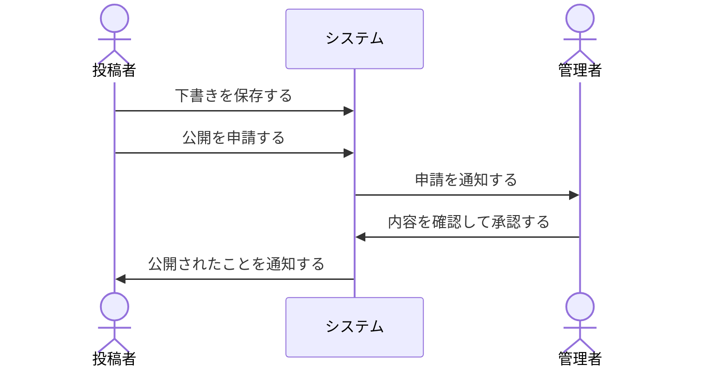

# 04 業務フロー

<!--
  システムを使った仕事の流れ（誰が・いつ・何をするか）を書く。
  複数の人や外部サービスが関わる流れがある場合に書く。画面をいくつか操作して終わるだけのアプリなら、このファイルは消してよい。
-->

## 1. 業務フロー一覧

| No | フロー | 関わる人・システム | 関連する機能 |
| -- | ------ | ------------------ | ------------ |
| 1 | （例）投稿の公開 | 投稿者、管理者 | F-001, F-002 |

## 2. フローごとの詳細

### 2.1 （例）投稿の公開

| 項目 | 内容 |
| ---- | ---- |
| きっかけ | 投稿者が公開を申請する |
| 完了の条件 | 投稿が公開され、投稿者に通知が届く |
| 例外 | 差し戻されたときは、投稿者が修正して再申請する |

## 3. 変更履歴

| 日付 | 変更内容 | 変更者 |
| ---- | -------- | ------ |
| YYYY-MM-DD | 新規作成 | |
