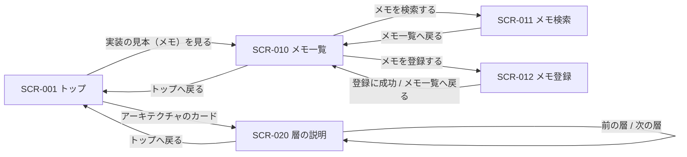

# 01 サイトマップ・画面一覧

<!--
  画面一覧はこのファイルを正本とする。
  画面ごとの詳細は 03_画面設計/SCR-XXX_画面名.md に書き、下の表からリンクする。
-->

## 1. サイトマップ

<!-- URL の階層をツリーで書く。src/app のフォルダ構成とほぼ一致する -->

```
/
├─ /login
├─ /notes
│   ├─ /notes/search
│   └─ /notes/new
├─ /architecture
│   └─ /architecture/[layer]
└─ /admin
    └─ /admin/...
```

## 2. 画面一覧

| 画面ID | 画面名 | パス | 実装ファイル | 権限 | 詳細設計 | ステータス |
| ------ | ------ | ---- | ------------ | ---- | -------- | ---------- |
| SCR-001 | トップ | `/` | `src/app/page.tsx` | 全員 | [SCR-001](../03_画面設計/SCR-001_トップ.md) | レビュー待ち |
| SCR-010 | メモ一覧 | `/notes` | `src/app/notes/page.tsx` | 全員 | [SCR-010](../03_画面設計/SCR-010_メモ一覧.md) | レビュー待ち |
| SCR-011 | メモ検索 | `/notes/search` | `src/app/notes/search/page.tsx` | 全員 | [SCR-011](../03_画面設計/SCR-011_メモ検索.md) | レビュー待ち |
| SCR-012 | メモ登録 | `/notes/new` | `src/app/notes/new/page.tsx` | 全員 | [SCR-012](../03_画面設計/SCR-012_メモ登録.md) | レビュー待ち |
| SCR-020 | 層の説明 | `/architecture/[layer]` | `src/app/architecture/[layer]/page.tsx` | 全員 | [SCR-020](../03_画面設計/SCR-020_層の説明.md) | レビュー待ち |

- 画面ID: `SCR-XXX`。機能のまとまりごとに 10 ずつ空けると、後から画面を追加しやすい（例: 010 番台は一覧・詳細、900 番台は管理画面）
- 権限: [01 概要](../00_要件定義/01_概要.md) の「対象ユーザー」で決めた種別を使う（`全員` / `ログイン済み` / `管理者` など）
- 詳細設計: `[SCR-001](../03_画面設計/SCR-001_トップ.md)` のようにリンクする
- ステータス: `未着手` / `設計中` / `レビュー待ち` / `確定`

## 3. 画面遷移図



## 4. 共通で存在する画面

<!-- Next.js の特殊ファイルで表示する画面。独自の画面を作るかどうかを決める -->

| 画面 | 実装ファイル | 独自に作る | 備考 |
| ---- | ------------ | ---------- | ---- |
| 404 Not Found | `src/app/not-found.tsx` | する / しない | |
| エラー | `src/app/error.tsx` / `global-error.tsx` | する / しない | |
| 401 未認証 | `src/app/unauthorized.tsx` | する / しない | experimental（`authInterrupts`） |
| 403 権限なし | `src/app/forbidden.tsx` | する / しない | experimental（`authInterrupts`） |

## 5. 変更履歴

| 日付 | 変更内容 | 変更者 |
| ---- | -------- | ------ |
| YYYY-MM-DD | 新規作成 | |
| 2026-09-23 | SCR-001 トップの詳細設計を追加 | |
| 2026-09-23 | SCR-010 サンプル一覧を追加 | |
| 2026-09-23 | SCR-001 から SCR-010 への遷移を追加 | |
| 2026-09-23 | SCR-011 サンプル検索を追加 | |
| 2026-09-24 | SCR-020 層の説明を追加 | |
| 2026-09-26 | SCR-012 サンプル登録を追加 | |
| 2026-09-26 | 実装の見本の題材を「サンプル」から「メモ」に変えた（SCR-010〜012、`/notes`） | |
