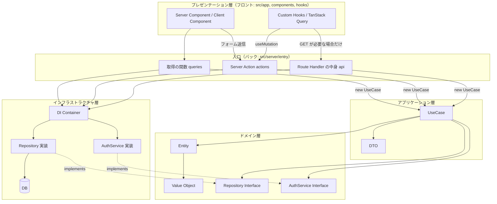
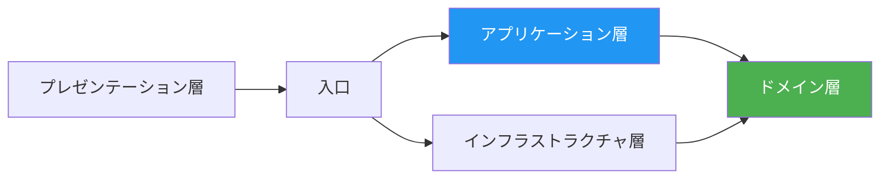
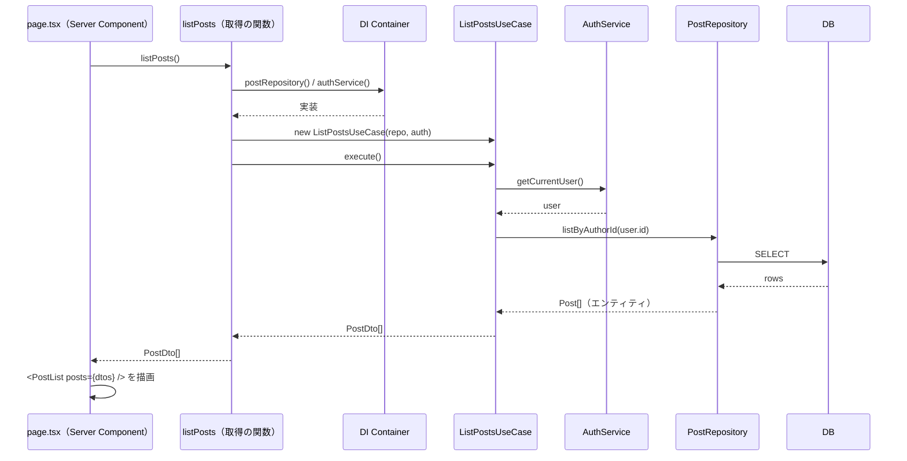
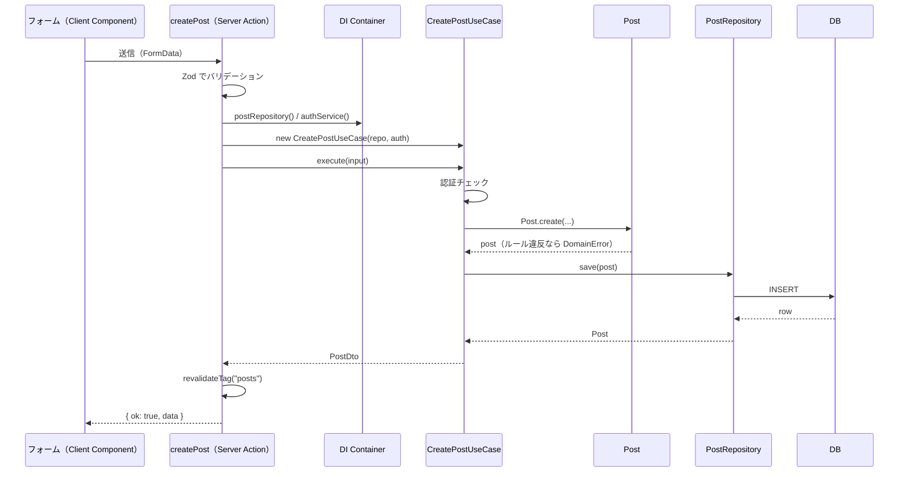

# 06 アーキテクチャ

<!--
  コードをどの層に分け、層どうしがどう依存するかを書く。
  ファイルの置き場所の一覧は 05_ディレクトリ構成、各処理の書き方のルールは 02_共通設計 に書く。
  例は「投稿（Post）」を題材にしている。実際のドメインに合わせて置き換える。
-->

## 1. 方針

**DDD（ドメイン駆動設計）** と **クリーンアーキテクチャ** の考え方で、コードを層に分ける。

| 考え方 | 目的 |
| ------ | ---- |
| DDD | 業務のルールをドメイン層に集め、画面や DB の都合と切り離す |
| クリーンアーキテクチャ | 依存の向きを「外側 → 内側」の一方向にそろえ、DB や認証サービスを差し替えやすくする |
| コンストラクタインジェクション | ユースケースが使う部品（リポジトリなど）を外から渡し、テストでモックに差し替えられるようにする |

### Next.js に合わせて変えている点

一般的なクリーンアーキテクチャの例では「画面 → API（HTTP）→ ユースケース」とつなぐことが多い。このプロジェクトでは Next.js App Router の仕組みに合わせて、次のようにする。

| 処理 | 入口 | 理由 |
| ---- | ---- | ---- |
| 画面の表示に使うデータの取得 | **取得の関数**（`src/server/entry/queries/`）。Server Component（`page.tsx` など）から呼ぶ | サーバー内で直接ユースケースを呼べるので、API を作って HTTP で往復する必要がない |
| データの更新 | **Server Action**（`src/server/entry/actions/`） | フォームから直接呼べ、更新後のキャッシュの再検証も同じ場所で書ける |
| 外部から呼ばれる API、Webhook など | **Route Handler の中身**（`src/server/entry/api/`）。`route.ts` から読み込む | [04 データ取得・更新](../02_共通設計/04_データ取得・更新.md) の「4. Route Handler」の場合だけ使う |

この 3 つを **入口（Entry Point）** と呼び、依存の組み立て（Composition Root）もここで行う。

### フロントとバックの分け方

`src/server/` の外を**フロント**、中を**バック**とする（[ADR-008](../04_設計判断/ADR-008_フロントとバックの分け方.md)）。

| | 置き場所 | 持つもの |
| -- | -------- | -------- |
| フロント | `src/app/`、`src/components/`、`src/hooks/` | 画面の表示、ユーザーの操作の受け付け（プレゼンテーション層） |
| バック | `src/server/` | 入口、アプリケーション層、ドメイン層、インフラストラクチャ層 |

- フロントからバックへの入り口は `src/server/entry/` だけにする。フロントが import してよいのは、`src/server/entry/` の関数と DTO の型だけ
- この import の制限は ESLint でチェックする（下の「2. 層の構成」の「依存の向き」）
- Next.js の決まりで、`page.tsx` と `route.ts` は `src/app/` から動かせない。`page.tsx` は取得の関数を呼んで結果を部品に渡すだけ、`route.ts` は `src/server/entry/api/` から読み込むだけにする

## 2. 層の構成

| 層 | 役割 | 場所 |
| -- | ---- | ---- |
| プレゼンテーション層（フロント） | 画面の表示、ユーザーの操作を受け付ける | `src/app/`（page / layout など）、`src/components/`、`src/hooks/` |
| 入口（Entry Point） | 入力の受け取りとバリデーション、依存の組み立て、ユースケースの呼び出し、結果を画面や HTTP の形に変換 | `src/server/entry/`（`queries/`、`actions/`、`api/`） |
| アプリケーション層 | ユースケース（1 つの操作の手順）。認証・認可のチェック、ドメインの呼び出し、DTO への変換 | `src/server/application/` |
| ドメイン層 | 業務のルール。エンティティ、値オブジェクト、リポジトリのインターフェース | `src/server/domain/` |
| インフラストラクチャ層 | DB、認証サービス、外部 API の実装。DI コンテナ | `src/server/infrastructure/` |

### 全体図



### 依存の向き



| ルール | 内容 |
| ------ | ---- |
| 向き | 外側から内側への依存だけを許す |
| ドメイン層 | どの層にも依存しない。Next.js、React、DB クライアントも import しない |
| アプリケーション層 | ドメイン層のインターフェースだけに依存する。インフラストラクチャ層（実装や DI コンテナ）は import しない |
| インフラストラクチャ層 | ドメイン層のインターフェースを実装する |
| 入口 | DI コンテナから実装を受け取り、ユースケースに渡す（Composition Root） |
| プレゼンテーション層 | `src/server/` から import してよいのは、`src/server/entry/` の関数と DTO の型（`import type`）だけ。DI コンテナ、ユースケース、ドメインは import しない |
| サーバー専用 | `src/server/application/`、`src/server/infrastructure/`、`src/server/entry/queries/`、`src/server/entry/api/` のファイルの先頭に `import 'server-only'` を書き、Client Component から読み込めないようにする。例外は DTO（型だけ読み込まれる）と `src/server/entry/actions/`（先頭に `'use server'` を書く） |

依存のルールは、ESLint の `no-restricted-imports`（`eslint.config.mjs`）でチェックする。`pnpm lint` でエラーになる。

| ファイル | import できないもの |
| -------- | ------------------- |
| フロント（`src/app/`、`src/components/`、`src/hooks/`） | `src/server/` のうち、`src/server/entry/` と DTO の型以外 |
| ドメイン層 | Next.js、React、Zod、ほかのすべての層、フロント |
| アプリケーション層 | インフラストラクチャ層、入口、フロント |
| インフラストラクチャ層 | ユースケース、入口、フロント（DTO は import してよい。「8. 小さな機能での省略」で、リポジトリが DTO を直接返す場合があるため） |
| 入口 | フロント |

- `@/` から書いた import と、相対パス（`../../application/...`）の両方をチェックする
- DB クライアントを決めたら、ドメイン層とアプリケーション層で import できないものに追加する

## 3. ディレクトリ構成

```
src/
│ ── フロント ──────────────────────────
├── app/                              # ルーティング（プレゼンテーション層）
│   ├── (main)/
│   │   └── posts/
│   │       ├── page.tsx              # 一覧。取得の関数を呼び、結果を部品に渡すだけ
│   │       ├── _components/          # この画面だけで使うコンポーネント
│   │       └── [id]/
│   │           └── page.tsx
│   ├── api/                          # Route Handler（必要な場合だけ）
│   │   ├── v1/posts/route.ts         # 外部公開 API。src/server/entry/api/ から読み込むだけ
│   │   ├── webhooks/                 # Webhook の受け口
│   │   └── internal/                 # 画面から使うもの（ダウンロードなど）
│   ├── layout.tsx
│   ├── providers.tsx                 # TanStack Query / Jotai の Provider
│   └── globals.css
│
├── components/                       # 複数の画面で使うコンポーネント
│   ├── atoms/                        # 最小の部品（shadcn/ui の基本部品を含む）
│   │   └── button/index.tsx
│   ├── molecules/                    # atoms を組み合わせた部品
│   └── organisms/                    # 画面の一区画（ヘッダーなど）
├── hooks/                            # Custom Hooks
│
│ ── バック ────────────────────────────
├── server/
│   ├── entry/                        # 入口（Composition Root はここだけ）
│   │   ├── queries/                  # 取得。Server Component から呼ぶ
│   │   │   └── post/
│   │   │       └── list-posts.ts
│   │   ├── actions/                  # 更新（Server Action）
│   │   │   ├── types.ts              # ActionResult
│   │   │   └── post/
│   │   │       └── create-post.ts
│   │   └── api/                      # Route Handler の中身
│   │       ├── problem-details.ts    # 失敗したときのレスポンス（RFC 9457）
│   │       ├── v1/
│   │       │   ├── posts.ts
│   │       │   └── public-post.ts    # 外部向けの型と変換
│   │       └── internal/             # 画面から TanStack Query で呼ぶもの
│   │
│   ├── application/                  # アプリケーション層
│   │   ├── dto/
│   │   │   └── post/
│   │   │       └── post.dto.ts
│   │   └── usecase/
│   │       └── post/
│   │           ├── create-post.usecase.ts
│   │           ├── list-posts.usecase.ts
│   │           └── get-post.usecase.ts
│   │
│   ├── domain/                       # ドメイン層
│   │   ├── shared/
│   │   │   └── domain-error.ts       # 業務エラーの基底クラス
│   │   ├── post/
│   │   │   ├── entity.ts
│   │   │   ├── repository.ts         # インターフェース
│   │   │   └── value-objects/
│   │   │       ├── post-id.ts
│   │   │       └── post-title.ts
│   │   └── auth/
│   │       ├── service.ts            # インターフェース
│   │       └── exception.ts
│   │
│   └── infrastructure/               # インフラストラクチャ層
│       ├── di/
│       │   └── container.ts
│       ├── database/
│       │   └── post/
│       │       ├── post-repository-impl.ts
│       │       └── post-mapper.ts    # DB の行 ⇔ エンティティ の変換
│       └── auth/
│           └── auth-service-impl.ts
│
│ ── どちらにも属さない ────────────────
├── lib/                              # 層に属さないユーティリティ
│   └── utils.ts                      # shadcn/ui の cn()
│
└── proxy.ts                          # リクエスト前の処理（旧 middleware）
```

## 4. 各層の責務と書き方

### 4.1 入口（`src/server/entry/`）

**やること**

- 入力の受け取りとバリデーション（Zod）
- DI コンテナから実装を取り出し、ユースケースを組み立てる
- ユースケースを実行し、結果を画面や HTTP の形にする
- 想定内のエラー（業務エラー、未認証）を戻り値や画面遷移に変換する

**やらないこと**

- 業務のルールを書く（ドメイン層に書く）
- DB に直接アクセスする

#### 取得（`src/server/entry/queries/`）

```ts
// src/server/entry/queries/post/list-posts.ts
import "server-only";
import { container } from "@/server/infrastructure/di/container";
import { ListPostsUseCase } from "@/server/application/usecase/post/list-posts.usecase";
import type { PostDto } from "@/server/application/dto/post/post.dto";

export async function listPosts(): Promise<PostDto[]> {
  // Composition Root: 依存を組み立ててユースケースを作る
  const useCase = new ListPostsUseCase(
    container.postRepository(),
    container.authService(),
  );

  // DTO（プレーンなオブジェクト）を返すので、画面はそのまま Client Component に渡せる
  return useCase.execute();
}
```

呼び出す側の `page.tsx`（プレゼンテーション層）は、取得の関数を呼んで結果を部品に渡すだけにする。

```tsx
// src/app/(main)/posts/page.tsx
import { listPosts } from "@/server/entry/queries/post/list-posts";
import { PostList } from "./_components/post-list";

export default async function Page() {
  const posts = await listPosts();
  return <PostList posts={posts} />;
}
```

- 1 つの画面で複数のデータを取るときも、取得の関数は 1 つのデータにつき 1 つにし、`page.tsx` で `Promise.all` する
- キャッシュ（`'use cache'`、`cacheTag` など）は取得の関数に書く（[04 データ取得・更新](../02_共通設計/04_データ取得・更新.md)）
- 未ログインや権限なしの扱いは [01 認証・認可](../02_共通設計/01_認証・認可.md) に従う。`redirect()` / `notFound()` は取得の関数の中で呼んでよい

#### 更新（`src/server/entry/actions/`）

```ts
// src/server/entry/actions/post/create-post.ts
"use server";

import { revalidateTag } from "next/cache";
import { z } from "zod";
import { container } from "@/server/infrastructure/di/container";
import { CreatePostUseCase } from "@/server/application/usecase/post/create-post.usecase";
import type { PostDto } from "@/server/application/dto/post/post.dto";
import { DomainError } from "@/server/domain/shared/domain-error";
import { UnauthorizedException } from "@/server/domain/auth/exception";
import type { ActionResult } from "@/server/entry/actions/types";

const CreatePostSchema = z.object({
  title: z.string().min(1, "タイトルを入力してください"),
  body: z.string(),
});

export async function createPost(
  _prev: ActionResult<PostDto> | null,
  formData: FormData,
): Promise<ActionResult<PostDto>> {
  // 1. 入力のバリデーション
  const parsed = CreatePostSchema.safeParse(Object.fromEntries(formData));
  if (!parsed.success) {
    return {
      ok: false,
      message: "入力内容を確認してください",
      fieldErrors: z.flattenError(parsed.error).fieldErrors,
    };
  }

  // 2. Composition Root
  const useCase = new CreatePostUseCase(
    container.postRepository(),
    container.authService(),
  );

  // 3. 実行。想定内のエラーだけ戻り値に変換し、想定外のものはそのまま投げる
  try {
    const post = await useCase.execute(parsed.data);
    revalidateTag("posts");
    return { ok: true, data: post };
  } catch (error) {
    if (error instanceof UnauthorizedException) {
      return { ok: false, message: "ログインしてください" };
    }
    if (error instanceof DomainError) {
      return { ok: false, message: error.message };
    }
    throw error;
  }
}
```

- 戻り値の形（`ActionResult`）は [04 データ取得・更新](../02_共通設計/04_データ取得・更新.md) にそろえる
- エラーの扱いは [06 エラー処理](../02_共通設計/06_エラー処理.md) に従う
- `redirect()` を使う場合は `try/catch` の外で呼ぶ
- 1 つのファイルに 1 つの Server Action を書く。Client Component からは `@/server/entry/actions/...` を直接 import してよい（`'use server'` のファイルなので、ブラウザには呼び出し口だけが渡る）

#### Route Handler（`src/server/entry/api/`）

外部から呼ばれる API など、[04 データ取得・更新](../02_共通設計/04_データ取得・更新.md) で決めた場合だけ使う。書き方は Server Action と同じで、戻り値を `Response` にする点だけが違う。外部に公開する API のルール（認証、バージョン、レスポンスの形）は [09 外部公開 API](../02_共通設計/09_外部公開API.md) に従う。

中身は `src/server/entry/api/` に書き、`src/app/` の `route.ts` はそれを読み込むだけにする。

```ts
// src/app/api/v1/posts/route.ts
export { GET } from "@/server/entry/api/v1/posts";
```

- ルートの設定（`export const dynamic` など）を書く場合は、Next.js が読み取れるように `route.ts` に直接書く

### 4.2 プレゼンテーション層

**やること**

- 画面の表示、ユーザーの操作の受け付け
- UI だけに関する状態の管理（開閉、選択中のタブなど。画面をまたぐものは Jotai）

**ルール**

| ルール | 理由 |
| ------ | ---- |
| `src/server/` から import するのは、`src/server/entry/` の関数と DTO の型だけにする。ユースケース、リポジトリ、DI コンテナ、ドメインは import しない（Server Component でも同じ） | フロントとバックの境目を 1 か所にするため。Client Component から読み込むと、`server-only` によりビルドエラーにもなる |
| `page.tsx` では依存を組み立てない。取得の関数を呼んで結果を部品に渡すだけにする | 組み立ては入口の役割なので |
| エンティティを props で受け取らない。DTO（プレーンなオブジェクト）を受け取る | クラスのインスタンスは Client Component に渡せない。また、表示に不要な項目まで渡ってしまう |
| 更新は Server Action を呼ぶ | `fetch('/api/...')` で自前の API を呼ばない |
| TanStack Query は、クライアントで再取得やポーリングが必要な場合だけ使う | 通常の表示は Server Component の取得で足りる |

```tsx
// src/app/(main)/posts/_components/post-list.tsx
import type { PostDto } from "@/server/application/dto/post/post.dto";

// ✅ DTO を受け取る
export function PostList({ posts }: { posts: PostDto[] }) {
  return (
    <ul>
      {posts.map((post) => (
        <li key={post.id}>{post.title}</li>
      ))}
    </ul>
  );
}
```

> DTO は型だけを `import type` で読み込むので、`server-only` の対象にはならない。DTO のファイルには `server-only` を書かない。

### 4.3 アプリケーション層（ユースケース）

**やること**

- 1 つの操作の手順を書く（1 ユースケース = 1 クラス）
- 認証・認可のチェック
- ドメイン層の呼び出し（業務のルール自体はエンティティに任せる）
- 結果を DTO に変換して返す

```ts
// src/server/application/usecase/post/create-post.usecase.ts
import "server-only";
import type { PostRepository } from "@/server/domain/post/repository";
import type { AuthService } from "@/server/domain/auth/service";
import { Post } from "@/server/domain/post/entity";
import { UnauthorizedException } from "@/server/domain/auth/exception";
import { toPostDto, type PostDto } from "@/server/application/dto/post/post.dto";

type CreatePostInput = {
  title: string;
  body: string;
};

export class CreatePostUseCase {
  constructor(
    private readonly postRepository: PostRepository, // インターフェースに依存
    private readonly authService: AuthService, // インターフェースに依存
  ) {}

  async execute(input: CreatePostInput): Promise<PostDto> {
    // 1. 認証チェック
    const user = await this.authService.getCurrentUser();
    if (!user) {
      throw new UnauthorizedException();
    }

    // 2. エンティティを作る（ルールのチェックはエンティティの中で行う）
    const post = Post.create({
      authorId: user.id,
      title: input.title,
      body: input.body,
    });

    // 3. 保存
    const saved = await this.postRepository.save(post);

    // 4. DTO に変換して返す
    return toPostDto(saved);
  }
}
```

```ts
// src/server/application/dto/post/post.dto.ts
import type { Post } from "@/server/domain/post/entity";

// 画面に渡してよい項目だけを持つプレーンなオブジェクト
export type PostDto = {
  id: string;
  title: string;
  body: string;
  publishedAt: string | null; // Date ではなく ISO 文字列にしておくと扱いやすい
};

export function toPostDto(post: Post): PostDto {
  return {
    id: post.id.value,
    title: post.title.value,
    body: post.body,
    publishedAt: post.publishedAt?.toISOString() ?? null,
  };
}
```

> Next.js のドキュメントでいう **データアクセス層（DAL）** の役割（サーバーだけで動く、認可をチェックする、必要な項目だけの DTO を返す）は、このユースケースが担う。[01 認証・認可](../02_共通設計/01_認証・認可.md) と [04 データ取得・更新](../02_共通設計/04_データ取得・更新.md) の「データアクセス層」はユースケースを指す。

#### コンストラクタインジェクション

```ts
// ✅ 依存をコンストラクタで受け取る（インターフェースに依存）
export class CreatePostUseCase {
  constructor(
    private readonly postRepository: PostRepository,
    private readonly authService: AuthService,
  ) {}
}

// ❌ ユースケースの中で実装を直接 new する
const repository = new PostRepositoryImpl();

// ❌ ユースケースの中で DI コンテナを使う（アプリケーション層がインフラストラクチャ層に依存してしまう）
const repository = container.postRepository();
```

| メリット | 内容 |
| -------- | ---- |
| テストしやすい | モックを渡せば DB なしでテストできる |
| 依存がはっきりする | コンストラクタを見れば、何を使っているかがわかる |
| 差し替えやすい | DB や認証サービスを変えても、ユースケースは変更しなくてよい |

### 4.4 ドメイン層

**やること**

- 業務のルールを書く（エンティティのメソッド、値オブジェクトのチェック）
- リポジトリ、外部サービスのインターフェースを定義する

**ルール**

- どの層にも依存しない（Next.js、React、DB クライアント、Zod も使わない）
- エンティティは状態を変えるメソッドを持ち、外から直接プロパティを書き換えさせない
- 値オブジェクトは作った後に変更しない（不変）
- ルール違反は `DomainError` を継承した例外で表す

```ts
// src/server/domain/post/entity.ts
import { PostId } from "./value-objects/post-id";
import { PostTitle } from "./value-objects/post-title";
import { DomainError } from "../shared/domain-error";

export class Post {
  private constructor(
    readonly id: PostId,
    readonly authorId: string,
    private _title: PostTitle,
    private _body: string,
    private _publishedAt: Date | null,
  ) {}

  // 新しく作るとき
  static create(params: { authorId: string; title: string; body: string }): Post {
    return new Post(
      PostId.generate(),
      params.authorId,
      PostTitle.of(params.title),
      params.body,
      null,
    );
  }

  // DB から読み込んだデータで作り直すとき
  static reconstruct(params: {
    id: PostId;
    authorId: string;
    title: PostTitle;
    body: string;
    publishedAt: Date | null;
  }): Post {
    return new Post(params.id, params.authorId, params.title, params.body, params.publishedAt);
  }

  // 業務のルール
  publish(): void {
    if (this._publishedAt) {
      throw new DomainError("すでに公開されています");
    }
    this._publishedAt = new Date();
  }

  canEdit(userId: string): boolean {
    return this.authorId === userId;
  }

  get title(): PostTitle {
    return this._title;
  }
  get body(): string {
    return this._body;
  }
  get publishedAt(): Date | null {
    return this._publishedAt;
  }
}
```

```ts
// src/server/domain/post/value-objects/post-title.ts
import { DomainError } from "../../shared/domain-error";

export class PostTitle {
  private constructor(readonly value: string) {}

  static of(value: string): PostTitle {
    const trimmed = value.trim();
    if (trimmed.length === 0) {
      throw new DomainError("タイトルは必須です");
    }
    if (trimmed.length > 100) {
      throw new DomainError("タイトルは 100 文字以内にしてください");
    }
    return new PostTitle(trimmed);
  }
}
```

```ts
// src/server/domain/post/repository.ts
import type { Post } from "./entity";
import type { PostId } from "./value-objects/post-id";

export interface PostRepository {
  save(post: Post): Promise<Post>;
  findById(id: PostId): Promise<Post | null>;
  listByAuthorId(authorId: string): Promise<Post[]>;
  delete(id: PostId): Promise<void>;
}
```

```ts
// src/server/domain/auth/service.ts
export interface AuthService {
  getCurrentUser(): Promise<{ id: string; email: string } | null>;
}
```

> **Zod とドメインのチェックの違い**: Zod（入口）は「形式が正しいか」（必須、型、文字数など画面で出すエラー）を見る。ドメインは「業務として正しいか」（公開済みは再公開できない、など）を見る。文字数のように両方に出てくるルールは、ドメイン側を正とする。

### 4.5 インフラストラクチャ層

**やること**

- ドメイン層のインターフェースを実装する（DB、認証サービス、外部 API）
- DB の行とエンティティの変換
- DI コンテナで、インターフェースと実装を結びつける

#### DI コンテナ

```ts
// src/server/infrastructure/di/container.ts
import "server-only";
import type { PostRepository } from "@/server/domain/post/repository";
import type { AuthService } from "@/server/domain/auth/service";
import { PostRepositoryImpl } from "@/server/infrastructure/database/post/post-repository-impl";
import { AuthServiceImpl } from "@/server/infrastructure/auth/auth-service-impl";

/**
 * インターフェースと実装を結びつける。
 * 入口（src/server/entry/）からだけ使う。
 */
export const container = {
  postRepository: (): PostRepository => new PostRepositoryImpl(),
  authService: (): AuthService => new AuthServiceImpl(),
};
```

- 呼ぶたびに新しいインスタンスを作る。サーバーではリクエストをまたいでインスタンスが共有されるため、ユーザーごとの情報を持つ実装を使い回すと、別のユーザーに情報が漏れるおそれがある
- 1 リクエストの中で同じ取得を何度も行う場合は、実装側で React の `cache()` を使う（例: `getCurrentUser`）

#### リポジトリの実装

```ts
// src/server/infrastructure/database/post/post-repository-impl.ts
import "server-only";
import type { PostRepository } from "@/server/domain/post/repository";
import type { Post } from "@/server/domain/post/entity";
import type { PostId } from "@/server/domain/post/value-objects/post-id";
import { toEntity, toRow } from "./post-mapper";

export class PostRepositoryImpl implements PostRepository {
  async findById(id: PostId): Promise<Post | null> {
    // DB クライアントは 02_システム構成 で決めたものを使う
    const row = await db.post.findUnique({ where: { id: id.value } });
    return row ? toEntity(row) : null;
  }

  async save(post: Post): Promise<Post> {
    const row = await db.post.upsert({
      where: { id: post.id.value },
      create: toRow(post),
      update: toRow(post),
    });
    return toEntity(row);
  }

  // ...
}
```

- DB の命名（snake_case）とエンティティの命名（camelCase）の変換は、`*-mapper.ts` だけで行う
- 環境変数（`process.env`）を読むのはインフラストラクチャ層だけにする

## 5. 処理の流れ

### 5.1 取得（一覧の表示）



### 5.2 更新（投稿の作成）



## 6. テスト方針

層を分けているので、テストの中心は Next.js に依存しないドメイン層とユースケースになる。書き方のルールは [10 テスト](../02_共通設計/10_テスト.md) を参照。

| 層 | テストの内容 | 方法 | ツール |
| -- | ------------ | ---- | ------ |
| ドメイン層 | エンティティ、値オブジェクトのルール | そのまま単体テスト（依存がないのでモック不要） | Vitest |
| アプリケーション層 | ユースケースの手順、認可のチェック | リポジトリと AuthService をモックにして渡す | Vitest |
| インフラストラクチャ層 | DB とのやり取り、変換 | テスト用の DB を使う結合テスト | Vitest |
| プレゼンテーション層 | 表示だけのコンポーネント（DTO を受け取るもの） | 単体テスト | Vitest + React Testing Library |
| 入口・画面 | `async` の page、画面の操作の流れ | E2E テスト（必要な画面だけ） | Playwright |

- 入口（取得の関数 / Server Action / Route Handler）はユースケースを呼ぶだけなので、原則テストしない
- `async` の Server Component は Vitest でテストできない。表示部分を同期のコンポーネントに切り出すか、E2E テストで確認する

```ts
// src/server/application/usecase/post/create-post.usecase.test.ts
import { describe, expect, it, vi } from "vitest";
import { CreatePostUseCase } from "./create-post.usecase";
import { UnauthorizedException } from "@/server/domain/auth/exception";

// server-only は vitest.config.ts で空のモジュールに置き換えているので、ここでのモックは不要

describe("CreatePostUseCase", () => {
  it("ログインしていれば投稿を保存する", async () => {
    const repository = {
      save: vi.fn(async (post) => post),
      findById: vi.fn(),
      listByAuthorId: vi.fn(),
      delete: vi.fn(),
    };
    const authService = {
      getCurrentUser: vi.fn(async () => ({ id: "user-1", email: "a@example.com" })),
    };

    const useCase = new CreatePostUseCase(repository, authService);
    const result = await useCase.execute({ title: "タイトル", body: "本文" });

    expect(repository.save).toHaveBeenCalledOnce();
    expect(result.title).toBe("タイトル");
  });

  it("ログインしていなければ UnauthorizedException を投げる", async () => {
    const useCase = new CreatePostUseCase(
      { save: vi.fn(), findById: vi.fn(), listByAuthorId: vi.fn(), delete: vi.fn() },
      { getCurrentUser: vi.fn(async () => null) },
    );

    await expect(useCase.execute({ title: "t", body: "b" })).rejects.toThrow(
      UnauthorizedException,
    );
  });
});
```

## 7. やってはいけないこと

| NG | 理由 | 代わりに |
| -- | ---- | -------- |
| ユースケースの中で DI コンテナを使う | アプリケーション層がインフラストラクチャ層に依存してしまう | コンストラクタで受け取る |
| ユースケースの中で実装を `new` する | テストでモックに差し替えられない | コンストラクタで受け取る |
| page や Server Action で DB に直接アクセスする | 認可のチェックや変換が散らばる | ユースケースを通す |
| フロント（`src/app/`、`src/components/`、`src/hooks/`）から DI コンテナやユースケースを import する | フロントとバックの境目が崩れる | `src/server/entry/` の関数を呼ぶ |
| `src/app/` の中に Server Action（`actions.ts`）を置く | バックのコードがフロントに混ざる | `src/server/entry/actions/` に置く |
| Client Component でエンティティを受け取る | クラスは渡せず、不要な項目まで渡る | DTO を受け取る |
| Client Component から `fetch('/api/...')` で自前の API を呼ぶ | 不要な API が増え、認可のチェックも増える | 取得は Server Component、更新は Server Action |
| ドメイン層で Next.js や DB クライアントを import する | 業務のルールが技術に縛られる | インターフェースを定義し、インフラストラクチャ層で実装する |
| 業務のルールを入口やユースケースに書く | 同じルールがあちこちに書かれ、食い違う | エンティティ、値オブジェクトのメソッドにする |

## 8. 小さな機能での省略

すべての機能をこの形にすると、ファイルが多くなりすぎることがある。次の場合は省略してよい。

| 状況 | 省略してよいもの |
| ---- | ---------------- |
| 業務のルールがなく、読むだけ（マスタの一覧など） | エンティティ、値オブジェクト。リポジトリが DTO を直接返してよい |
| ルールがほとんどない単純な登録・更新 | 値オブジェクト |

ただし、**認可のチェック**と **DTO への変換**は省略しない。

## 9. 関連ドキュメント

- [02 システム構成](./02_システム構成.md)
- [05 ディレクトリ構成](./05_ディレクトリ構成.md)
- [01 認証・認可](../02_共通設計/01_認証・認可.md)
- [04 データ取得・更新](../02_共通設計/04_データ取得・更新.md)
- [05 フォーム・バリデーション](../02_共通設計/05_フォーム・バリデーション.md)
- [06 エラー処理](../02_共通設計/06_エラー処理.md)
- [09 外部公開 API](../02_共通設計/09_外部公開API.md)
- [ADR-001 コードの層分け](../04_設計判断/ADR-001_コードの層分け.md)
- [ADR-008 フロントとバックの分け方](../04_設計判断/ADR-008_フロントとバックの分け方.md)

## 10. 変更履歴

| 日付 | 変更内容 | 変更者 |
| ---- | -------- | ------ |
| 2026-09-23 | 新規作成 | |
| 2026-09-23 | バックを `src/server/` にまとめ、入口を `src/server/entry/` に分けた（[ADR-008](../04_設計判断/ADR-008_フロントとバックの分け方.md)） | |
| 2026-09-23 | 依存のルールを ESLint でチェックするようにし、「依存の向き」に表を追加 | |
